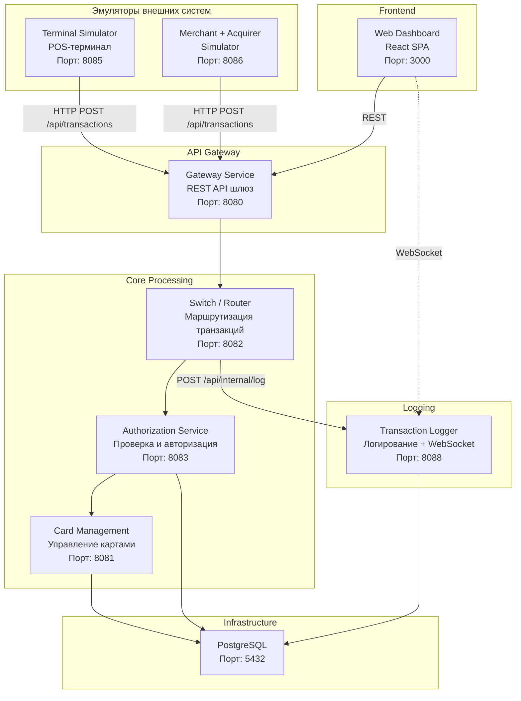

# Архитектура СМП

## Общая схема



---

## Путь транзакции (Sequence Diagram)

```mermaid
sequenceDiagram
    actor T as Terminal Simulator
    participant GW as Gateway
    participant SW as Switch
    participant AUTH as Authorization
    participant CMS as Card Management
    participant LOG as Logger

    T->>GW: POST /api/transactions (auth request)
    GW->>GW: validate request
    GW->>SW: forward transaction
    SW->>SW: extract BIN, route to issuer
    SW->>AUTH: POST /api/internal/authorize (AuthorizationRequest + issuerId)
    AUTH->>CMS: GET /api/cards/{pan}
    CMS-->>AUTH: Card {id, status, limits, ...}
    AUTH->>AUTH: check status, expiry, limits, balance
    alt approved
        AUTH->>CMS: POST /api/cards/{pan}/reserve {amount, rrn}
        CMS-->>AUTH: OK
        AUTH->>AUTH: generate RRN, authCode
        AUTH-->>SW: AuthResponse {approved, rrn, authCode}
    else declined
        AUTH-->>SW: AuthResponse {declined, reason}
    end
    SW->>LOG: POST /api/internal/log (синхронно)
    LOG-->>SW: OK
    SW-->>GW: TransactionResponse
    GW-->>T: HTTP 200 {approved|declined, ...}

    Note over AUTH,CMS: ⚠ Резервирование НЕ атомарно: между GET и POST /reserve<br/>другая параллельная транзакция может изменить баланс.<br/>Для учебного проекта допустимо, в production — SELECT ... FOR UPDATE.
```



---

## Модель данных

### Card (Карта)

| Поле | Тип | Описание |
|------|-----|----------|
| `id` | UUID | Уникальный идентификатор |
| `pan` | String(16) | Номер карты (только «наши» тестовые карты) |
| `bin` | String(6) | BIN (первые 6 цифр PAN) |
| `cardholderName` | String | Имя держателя |
| `expiryDate` | String(4) | Срок действия (MMYY) |
| `status` | Enum | ACTIVE, INACTIVE, BLOCKED, EXPIRED |
| `currencyCode` | String(3) | Код валюты (643 = RUB) |
| `dailyLimit` | BigDecimal | Дневной лимит |
| `monthlyLimit` | BigDecimal | Месячный лимит |
| `availableBalance` | BigDecimal | Доступный остаток |
| `issuerId` | String | ID банка-эмитента |
| `createdAt` | DateTime | Дата создания |

### Transaction (Транзакция)

| Поле | Тип | Описание |
|------|-----|----------|
| `id` | UUID | Уникальный идентификатор |
| `mti` | String(4) | Message Type Indicator (0100/0110) |
| `stan` | String(6) | System Trace Audit Number |
| `rrn` | String(12) | Retrieval Reference Number |
| `pan` | String(16) | Номер карты |
| `processingCode` | String(6) | Код операции (000000 = покупка) |
| `amount` | BigDecimal | Сумма в копейках/центах |
| `currencyCode` | String(3) | Код валюты |
| `terminalId` | String(8) | ID терминала |
| `merchantId` | String(15) | ID мерчанта |
| `mcc` | String(4) | Merchant Category Code |
| `acquirerId` | String | ID эквайрера |
| `issuerId` | String | ID эмитента |
| `status` | Enum | APPROVED, DECLINED |
| `declineReason` | String | Причина отказа |
| `authCode` | String(6) | Код авторизации |
| `transmissionDateTime` | DateTime | Время отправки |
| `createdAt` | DateTime | Время создания записи |

---

## Формат сообщений (упрощённый ISO 8583)

Все сервисы обмениваются JSON-сообщениями. Структура приближена к ISO 8583, но в JSON-формате для удобства.

### Authorization Request (0100)

```json
{
  "mti": "0100",
  "stan": "000001",
  "pan": "4000001234560001",
  "processingCode": "000000",
  "amount": 150000,
  "currencyCode": "643",
  "transmissionDateTime": "2026-06-01T10:30:00Z",
  "terminalId": "TERM001",
  "terminalType": "POS",
  "merchantId": "MERCH12345678901",
  "mcc": "5411",
  "acquirerId": "ACQ001"
}
```

### Authorization Response (0110)

```json
{
  "mti": "0110",
  "stan": "000001",
  "rrn": "012345678901",
  "authCode": "ABC123",
  "responseCode": "00",
  "status": "APPROVED",
  "processingTimeMs": 42
}
```

---

## Порты сервисов

| Сервис | Порт |
|--------|:---:|
| Gateway | 8080 |
| Card Management | 8081 |
| Switch | 8082 |
| Authorization | 8083 |
| Terminal Simulator | 8085 |
| Merchant Simulator | 8086 |
| Transaction Logger | 8088 |
| Dashboard | 3000 |
| PostgreSQL | 5432 |

---

## Ключевые принципы архитектуры

1. **Только свои карты** — обрабатываются только карты из Card Management. Нет понятия «внешних» BIN.
2. **Синхронное взаимодействие** — все сервисы общаются через HTTP REST. Нет очередей сообщений, нет асинхронных consumer'ов.
3. **Единая база данных** — один инстанс PostgreSQL используется **только тремя сервисами**: Card Management (таблица `cards`), Authorization (таблица `limit_usage`), Transaction Logger (таблица `transactions`). Остальные пять сервисов (Gateway, Switch, Terminal Simulator, Merchant Simulator, Dashboard) **не подключаются к БД напрямую** — они получают данные исключительно через REST API.
4. **Изоляция через API, а не через БД** — сервисы не читают и не пишут таблицы друг друга напрямую, даже если физически могут (общая БД). Взаимодействие между сервисами — только через REST API. Например, Authorization не делает `SELECT * FROM cards`, а вызывает `GET /api/cards/{pan}` у Card Management.
5. **Никакого антифрода** — сервис Fraud Engine исключён из архитектуры.
6. **Никакого клиринга** — сервис Clearing исключён из архитектуры. Взаиморасчёты между банками не эмулируются.
7. **Минимальная инфраструктура** — Docker Compose поднимает 8 сервисов + PostgreSQL. Без RabbitMQ, без Redis.
