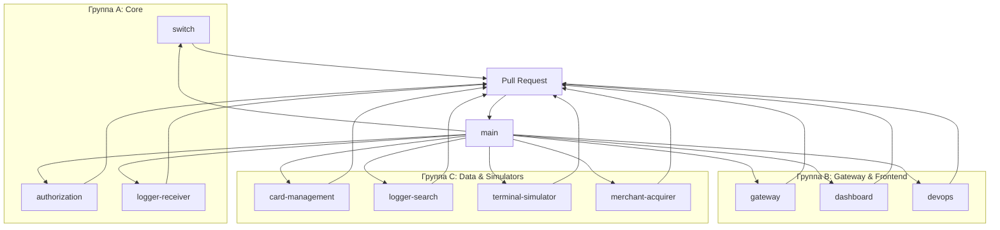
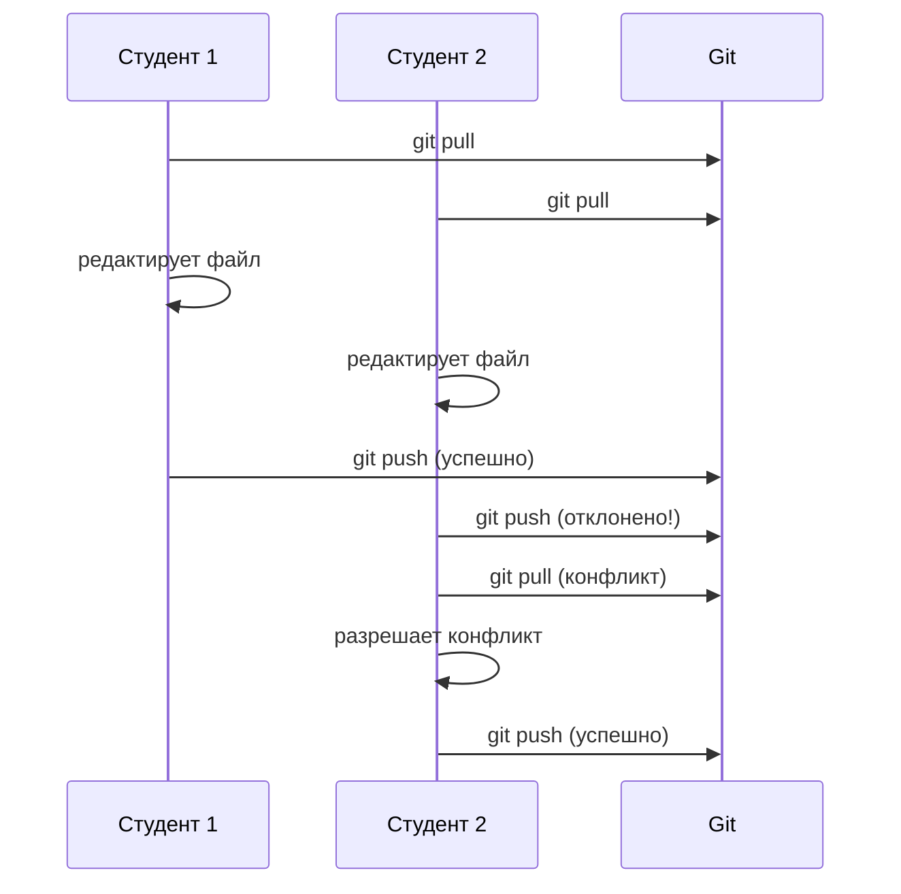
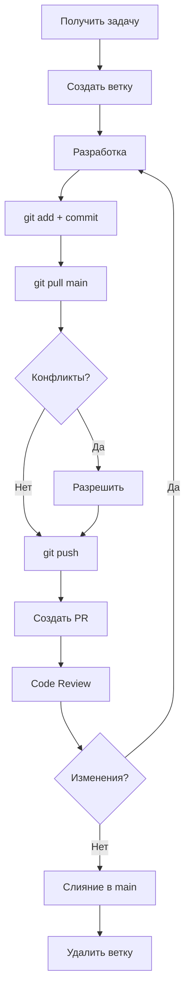

# Git Workflow — {PROJECT_NAME}

> Название проекта будет выбрано студентами в первый день практики.

---

## 1. Базовый уровень (День 1)

### Минимум для старта

```bash
# Клонирование репозитория
git clone <repo-url>
cd processing-practice

# Проверка состояния
git status

# Индексация изменений
git add .

# Коммит с сообщением
git commit -m "feat(gateway): add rate limiting"

# Отправка изменений
git push

# Получение изменений
git pull
```

---

## 2. Ветвление и командная работа

### Модель ветвления

| Тип ветки | Формат | Назначение |
|-----------|--------|------------|
| Основная | `main` | Стабильная версия, только через PR |
| Функциональная | `feature/<service>-<description>` | Новая функциональность |
| Исправление | `fix/<service>-<description>` | Исправление багов |
| Срочное исправление | `hotfix/<description>` | Критические исправления |

### Примеры имён веток

```
feature/gateway-rate-limiting
feature/authorization-luhn-check
fix/switch-routing-error
hotfix/database-connection
```

### Создание новой ветки

```bash
# Обновить main
git checkout main
git pull

# Создать и переключиться на новую ветку
git checkout -b feature/gateway-auth

# Или через GitHub/GitLab UI
```

---

## 3. Git Flow для групповой работы

### Структура команд



### Правила работы

1. **Каждая задача — отдельная ветка**
2. **Ветка живёт пока задача не завершена**
3. **Слияние только через Pull Request**
4. **Code Review обязателен**
5. **Конфликты решаются в ветке, не в main**

---

## 4. Правила коммитов (Conventional Commits)

### Формат

```
<type>(<scope>): <subject>

<body>

<footer>
```

### Типы коммитов

| Тип | Описание | Пример |
|-----|----------|--------|
| `feat` | Новая функциональность | `feat(gateway): add rate limiting` |
| `fix` | Исправление бага | `fix(authorization): handle null card` |
| `docs` | Документация | `docs(readme): update quick start` |
| `style` | Форматирование (без логики) | `style: fix indentation` |
| `refactor` | Рефакторинг | `refactor(switch): simplify routing` |
| `test` | Тесты | `test(cms): add card generation tests` |
| `chore` | Сборка, инструменты | `chore: update dependencies` |

### Примеры хороших коммитов

```
feat(gateway): add rate limiting for /api/transactions

- Implement token bucket algorithm
- Add 100 req/sec limit
- Return 429 when exceeded

Closes #42
```

```
fix(authorization): handle null card response

Previously, null card from CMS caused NPE.
Now returns DECLINED with proper error message.

Fixes #15
```

### Примеры плохих коммитов

```
fix bug
update
done
wip
```

---

## 5. Работа с конфликтами

### Сценарий конфликта



### Пошаговое разрешение

```bash
# 1. Получить изменения из main
git checkout main
git pull

# 2. Переместить изменения в свою ветку
git checkout feature/my-feature
git rebase main

# 3. Если есть конфликты — открыть файлы
# Конфликт будет отмечен так:
# <<<<<<< HEAD
# код из main
# =======
# твой код
# >>>>>>> feature/my-feature

# 4. Разрешить конфликт (оставить нужное, удалить остальное)
# Удалить маркеры <<<<<<<, =======, >>>>>>>

# 5. Добавить файлы и продолжить rebase
git add <файлы с конфликтами>
git rebase --continue

# 6. Если нужно прервать rebase
git rebase --abort

# 7. Отправить изменения
git push --force-with-lease  # ВНИМАНИЕ: только после rebase!
```

### Предотвращение конфликтов

1. **Чаще делайте `git pull`** — минимум раз в час
2. **Меньше живите в ветке** — завершайте задачи за 1-2 дня
3. **Коммуницируйте** — сообщайте команде, над чем работаете
4. **Разделяйте файлы** — не работайте над одним файлом в разных ветках

---

## 6. Pre-commit хуки

### Что это и зачем

Pre-commit хуки автоматически проверяют код перед каждым коммитом. В проекте уже настроены проверки в [`.pre-commit-config.yaml`](../.pre-commit-config.yaml).

### Установка

```bash
# Установить pre-commit
pip install pre-commit

# Активировать хуки в репозитории
pre-commit install
```

### Что проверяют хуки

| Проверка | Язык | Описание |
|----------|------|----------|
| trailing-whitespace | Все | Удаляет пробелы в конце строк |
| end-of-file-fixer | Все | Добавляет пустую строку в конец файла |
| check-yaml | Все | Проверяет синтаксис YAML |
| check-json | Все | Проверяет синтаксис JSON |
| check-merge-conflict | Все | Находит незавершённые конфликты |
| detect-private-key | Все | Находит случайно добавленные ключи |
| checkstyle | Java | Проверяет стиль кода |
| go-vet, go-fmt | Go | Проверяет и форматирует код |
| flake8 | Python | Проверяет стиль кода |
| eslint | TypeScript | Проверяет и исправляет стиль |

### Запуск вручную

```bash
# Проверить все файлы
pre-commit run --all-files

# Проверить только изменённые файлы
pre-commit run
```

### Пропуск проверки (если очень надо)

```bash
git commit --no-verify -m "message"
```

> ⚠️ Используйте `--no-verify` только в исключительных случаях!

---

## 7. Gitignore и секреты

### Что НЕ коммитить

```gitignore
# Переменные окружения
.env
.env.local
.env.*.local

# Зависимости
node_modules/
target/
__pycache__/
*.pyc
vendor/

# Логи
*.log
logs/

# Временные файлы
.DS_Store
Thumbs.db
*.swp
*.swo
*~

# IDE
.idea/
.vscode/
*.iml
```

### Работа с секретами

1. **Никогда не коммитите пароли, ключи, токены**
2. **Используйте `.env` файлы** (они в `.gitignore`)
3. **Для продакшена** — используйте секреты GitHub/GitLab
4. **Проверьте хук `detect-private-key`** — он найдёт случайно добавленные ключи

---

## 8. Практические сценарии

### Начать новую задачу

```bash
git checkout main
git pull
git checkout -b feature/gateway-auth
# ... работа ...
git add .
git commit -m "feat(gateway): add authentication"
git push -u origin feature/gateway-auth
```

### Сохранить незавершённую работу

```bash
# Сохранить изменения
git stash

# Посмотреть список stash
git stash list

# Вернуть изменения
git stash pop

# Применить и удалить конкретный stash
git stash drop stash@{0}
```

### Отменить последний коммит

```bash
# Отменить коммит, но сохранить изменения
git reset --soft HEAD~1

# Отменить коммит и изменения
git reset --hard HEAD~1

# Отменить несколько коммитов
git reset --soft HEAD~3
```

### Посмотреть историю

```bash
# Краткая история
git log --oneline

# Граф веток
git log --oneline --graph --all

# История конкретного файла
git log --oneline --follow path/to/file

# Изменения в коммите
git show <commit-hash>
```

### Сравнить ветки

```bash
# Различия между ветками
git diff main...feature-branch

# Различия в конкретном файле
git diff main...feature-branch -- path/to/file

# Какие коммиты есть в feature, но нет в main
git log main..feature-branch --oneline
```

### Отменить изменения в файле

```bash
# Отменить изменения в рабочей директории
git checkout -- path/to/file

# Отменить изменения в индексе
git reset HEAD path/to/file
```

---

## 9. Рекомендуемый рабочий процесс



### Ежедневный чек-лист

- [ ] `git pull` перед началом работы
- [ ] `git status` — проверяю, что не забыл добавить
- [ ] `git commit -m "type(scope): description"` — правильный формат
- [ ] `git push` — отправляю изменения
- [ ] Создаю PR — для code review
- [ ] Разрешаю конфликты — если есть

---

## 10. Pull Request (PR)

### Создание PR

1. Откройте GitHub/GitLab
2. Нажмите "New Pull Request"
3. Выберите свою ветку → `main`
4. Заполните шаблон PR

### Шаблон PR

```markdown
## Описание
Краткое описание изменений.

## Тип изменений
- [ ] Новая функциональность (feat)
- [ ] Исправление бага (fix)
- [ ] Рефакторинг (refactor)
- [ ] Документация (docs)
- [ ] Тесты (test)

## Проверки
- [ ] Код проходит линтер
- [ ] Добавлены/обновлены тесты
- [ ] Обновлена документация
- [ ] Нет console.log / print / debug

## Связанные задачи
Closes #123
Related to #456

## Скриншоты (если применимо)

```

### Code Review

1. **Проверяйте внимательно** — это обучение
2. **Комментируйте конструктивно** — объясняйте, почему
3. **Не принимайте автоматически** — задавайте вопросы
4. **Исправляйте быстро** — не держите PR открытым

---

## 11. Дополнительные ресурсы

### Интерактивное обучение

- [Learn Git Branching](https://learngitbranching.js.org/) — лучший интерактивный туториал
- [Git Immersion](http://gitimmersion.com/) — погружение в git

### Документация

- [Git Handbook](https://guides.github.com/introduction/git-handbook/) — официальное руководство GitHub
- [Pro Git Book](https://git-scm.com/book/ru/v2) — полная документация
- [Conventional Commits](https://www.conventionalcommits.org/) — спецификация коммитов

### Шпаргалки

- [Git Cheat Sheet](https://education.github.com/git-cheat-sheet-education.pdf) — официальная шпаргалка GitHub
- [Visual Git Cheat Sheet](https://ndpsoftware.com/git-cheatsheet.html) — визуальная шпаргалка

---

## 12. Частые ошибки и как их избежать

| Ошибка | Причина | Решение |
|--------|---------|---------|
| `rejected` при push | Кто-то уже запушил в main | Работайте в ветке, делайте PR |
| Конфликты каждый раз | Долго живёте в ветке | Завершайте задачи за 1-2 дня |
| Забыл добавить файл | `git status` не проверил | Проверяйте статус перед коммитом |
| Плохой коммит | Не следую Conventional Commits | Используйте шаблон |
| Секреты в репозитории | Не настроен .gitignore | Добавьте `.env` в gitignore |

---

## 13. Полезные алиасы

Добавьте в `~/.gitconfig`:

```ini
[alias]
    st = status
    co = checkout
    br = branch
    ci = commit
    lg = log --oneline --graph --all
    unstage = reset HEAD --
    last = log -1 HEAD
    amend = commit --amend --no-edit
```

Использование:

```bash
git st          # git status
git co main     # git checkout main
git lg          # красивый лог
```

---

## 14. Контакты и помощь

**Куратор практики:** [Имя Фамилия]
**Telegram-чат группы:** [ссылка]

Если возникли проблемы с git:
1. Проверьте этот документ
2. Спросите в командном чате
3. Обратитесь к куратору

---

**Удачи в работе с git!** 🚀
