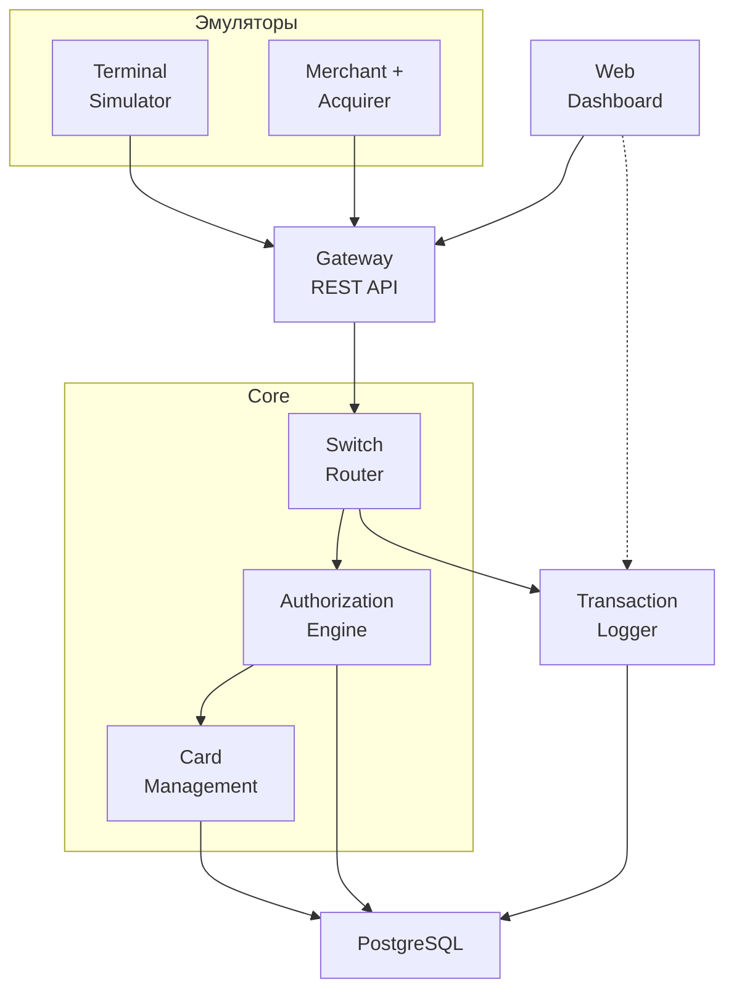

# СМП — Программа студенческой практики

**[Университет-партнёр]**
**[Город, Год]**

---

## 1. Суть проекта

`СМП` — учебный симулятор процессингового центра на микросервисной архитектуре. Проект эмулирует полный путь банковской транзакции:

```text
Терминал → Эквайрер → Gateway → Switch → Authorization → Card Management → Ответ
```

**Ключевые упрощения по сравнению с промышленными системами:**
- Все взаимодействия синхронные (HTTP REST, без очередей сообщений)
- Только «свои» тестовые карты из Card Management
- Нет антифрод-мониторинга
- Нет клиринга и взаиморасчётов между банками
- ISO 8583 эмулируется упрощённым JSON-форматом

---

## 2. Цифры

| Параметр | Значение |
|---|:---:|
| Студентов | 15 |
| Групп | 3 по 5 человек |
| Длительность | 4 недели (20 рабочих дней) |
| Нагрузка на студента | ~120 часов (6 ч/день) |
| Микросервисов | 8 |
| Ролей | 9 (8 разработческих + DevOps) |
| Языков программирования | 4 (Java, Go, Python, TypeScript) |
| Строк кода на студента | 300–1200 |

---

## 2.1. Деление на рабочие группы (3 группы × 5 человек)

Студенты делятся на три группы по зонам ответственности. Такое деление минимизирует точки синхронизации между группами и максимизирует — внутри. Transaction Logger расщеплён: один человек в Core (приём транзакций от Switch), второй в Data (поиск, статистика, WebSocket).

### Группа A: «Ядро процессинга» (Core)

| Роль | Чел. |
|------|:---:|
| Switch / Router | 2 |
| Authorization Service | 2 |
| Transaction Logger (приём) | 1 |
| **Итого** | **5** |

**Фокус:** бизнес-логика, маршрутизация и запись транзакций. Самая насыщенная точка интеграции — Switch → Authorization → Logger-приём образуют единый конвейер. Этим трём ролям нужна теснейшая синхронизация по API-контракту, форматам ответов, кодам ошибок и retry-логике.

### Группа B: «API и интерфейс» (Gateway & Frontend)

| Роль | Чел. |
|------|:---:|
| Gateway Service | 2 |
| Web Dashboard | 2 |
| DevOps | 1 |
| **Итого** | **5** |

**Фокус:** единая точка входа, OpenAPI-контракты, визуализация. Gateway — единственный вход в систему, Dashboard — единственный интерфейс пользователя. DevOps работает в этой группе, потому что Docker Compose, CI/CD и OpenAPI-спецификация естественно «живут» рядом с Gateway.

> **Организационная часть** (координация команд, ежедневные синхронизации, отслеживание прогресса, фиксация названия проекта) выполняется куратором практики.

### Группа C: «Данные и источники» (Data & Simulators)

| Роль | Чел. |
|------|:---:|
| Card Management | 2 |
| Transaction Logger (поиск/WS) | 1 |
| Terminal Simulator | 1 |
| Merchant + Acquirer Simulator | 1 |
| **Итого** | **5** |

**Фокус:** данные, хранение и генераторы тестового трафика. CMS + Logger-поиск = все данные системы (карты + транзакции). Симуляторы = источники тестовых транзакций. Logger-поиск и CMS работают с общей БД, Dashboard подключается к Logger-поиск через WebSocket.

---

## 3. Архитектура



---

## 4. План по неделям

### Неделя 1 — Фундамент и проектирование

| День | Событие |
|:---:|---|
| 1 | **Вводная лекция куратора (3–4h).** Deep-dive в процессинг: путь транзакции, ISO 8583, роли Visa/Mastercard, BIN, MCC, эквайринг vs эмиссия, reversal. Разбор архитектуры. **Задание:** придумать название процессинга |
| 2 | **Проектирование API-контрактов.** Кросс-командное обсуждение: Switch↔Authorization, Gateway↔все. Team Lead фиксирует OpenAPI-спецификацию |
| 3 | **Скелеты сервисов.** Каждый сервис: health-check. Docker Compose: все 8 сервисов в контейнерах |
| 4 | **CMS:** генератор 100 тестовых карт (алгоритм Луна). **Gateway:** первый endpoint, валидация |
| 5 | **⭐ Ревью куратора №1 (1h).** Docker работает, контракты зафиксированы. **Рефлексия:** каждая группа докладывает: что получилось, какие трудности, оценка рисков |

### Неделя 2 — Первый сквозной прогон

| День | Событие |
|:---:|---|
| 6 | **Gateway → Switch → Authorization → CMS:** первая сквозная транзакция. Полный цикл с реальными HTTP-вызовами |
| 7 | **Authorization:** полная бизнес-логика — статус карты, лимиты (дневной/месячный), баланс, генерация RRN и authCode, все decline-сценарии |
| 8 | **Симуляторы:** Terminal (сценарий `normal`) + Merchant (сценарий `grocery`). Поток 50+ транзакций. **Logger:** запись в БД, базовый поиск |
| 9 | **Logger:** поиск с фильтрацией и пагинацией, статистика (`/stats`, `/recent`), WebSocket-эндпоинт |
| 10 | **⭐ Ревью куратора №2 (1h).** Полный синхронный цикл: терминал → ... → logger. **Кросс-командное ревью кода:** группы читают код друг друга, дают обратную связь |

### Неделя 3 — Стабилизация и Dashboard

| День | Событие |
|:---:|---|
| 11 | **Dashboard:** каркас на React, сетка виджетов, KPI-карточки, таблица последних транзакций |
| 12 | **Dashboard:** real-time графики (линейный поток + круговая диаграмма), WebSocket-интеграция, фильтры, модальное окно с деталями транзакции |
| 13 | **Симуляторы:** продвинутые сценарии. Terminal: `mixed`, `high_value`, `night_time`, `declines_test`. Merchant: `electronics`, `restaurant`, `travel`. Нагрузочный прогон 500+ транзакций |
| 14 | **Интеграционное тестирование.** Прогон всех сценариев всеми симуляторами. Поиск и исправление багов. Проверка всех decline-кодов |
| 15 | **⭐ Ревью куратора №3 (1h).** Система стабильна, 500 транзакций проходят. **Code freeze:** новый функционал не добавляется — только исправления и полировка |

### Неделя 4 — Качество, документация и защита

| День | Событие |
|:---:|---|
| 16 | **Рефакторинг.** Улучшение читаемости кода: понятные имена, разделение на слои, комментирование сложных мест. Приведение к единому стилю. JSDoc/JavaDoc/Pydoc |
| 17 | **Тестирование.** Unit-тесты: минимум 3 на сервис (основной сценарий + граничные случаи). **Нагрузочное тестирование:** скрипт прогона 1000+ транзакций, замер времени |
| 18 | **Документация.** README каждого сервиса (назначение, endpoints, как запустить). Общий README репозитория. Скриншоты Dashboard. Диаграммы архитектуры. Makefile |
| 19 | **Репетиция защиты / сухая защита.** Каждая группа показывает свою часть. Куратор даёт обратную связь. Доработка презентации и демо-сценария |
| 20 | **🎯 Финальная защита (3–4h).** Живое демо всей системы. Архитектурный обзор. Индивидуальные выводы студентов. Ретроспектива практики: что получилось, чему научились, что улучшить |

---

## 5. Что получает каждый студент

1. **Реальный код** — 300–1200 строк на Java/Go/Python/TypeScript
2. **Domain knowledge** — понимание работы процессингового центра
3. **Микросервисный опыт** — Docker, REST API, WebSocket, БД
4. **Командный опыт** — работа в распределённой команде, API-first разработка
5. **Артефакты для портфолио** — код, диаграммы, скриншоты работающей системы

---

## 6. Что получает компания

1. **Готовый демо-стенд** — для будущих практик, презентаций и онбординга
2. **Продуманная программа практики** — документы, ТЗ, критерии оценки
3. **Студенты, понимающие предметную область** — потенциальные стажёры/сотрудники
4. **Шаблон для масштабирования** — возможность тиражировать практику в другие вузы

---

## 7. Необходимая инфраструктура

### От организаторов:
- GitHub-репозиторий (приватный)
- Куратор
- Вводная презентация «Как работает процессинг»

### От студентов:
- Личные ноутбуки
- Установленные Docker, Git, IDE
- GitHub-аккаунты

**Важно:** никакого доступа к внутренним системам компаний не требуется. Вся разработка — на локальных машинах студентов.

---

## 8. Документация и инструментарий проекта

### Документы для студентов и кураторов

| Документ | Путь | Содержание |
|----------|------|------------|
| README | [`README.md`](README.md) | Концепция, быстрый старт, структура, задание по названию |
| Программа практики | [`docs/program-overview.md`](docs/program-overview.md) | План на 4 недели, цифры, FAQ |
| Архитектура | [`docs/architecture.md`](docs/architecture.md) | Диаграммы, модели данных, порты |
| API-контракт | [`docs/api-spec.md`](docs/api-spec.md) | Описание всех эндпоинтов и моделей |
| Критерии оценки | [`docs/evaluation-criteria.md`](docs/evaluation-criteria.md) | Общие критерии + специфичные по ролям |
| Чек-листы само-приёмки | [`docs/checklists.md`](docs/checklists.md) | Поэтапные списки для самопроверки перед ревью |
| Шаблон README сервиса | [`docs/readme-template.md`](docs/readme-template.md) | Готовый шаблон для документирования сервиса |

### Инструменты автоматизации

| Инструмент | Путь | Описание |
|------------|------|----------|
| Pre-commit хуки | [`.pre-commit-config.yaml`](.pre-commit-config.yaml) | Линтеры для Java/Go/Python/TS при каждом коммите |
| Smoke-test (Linux/Mac) | [`scripts/smoke-test.sh`](scripts/smoke-test.sh) | Автоматическая приёмка всех 8 сервисов |
| Smoke-test (Windows) | [`scripts/smoke-test.ps1`](scripts/smoke-test.ps1) | Автоматическая приёмка (PowerShell) |

### Starter kits (готовые скелеты проектов)

| Язык | Путь | Содержание |
|------|------|------------|
| Java (Spring Boot 3) | [`starters/java/`](starters/java/) | pom.xml, health-check, Dockerfile, application.yml |
| Go | [`starters/go/`](starters/go/) | go.mod, health-check, unit-тест, Dockerfile |
| Python (FastAPI) | [`starters/python/`](starters/python/) | requirements.txt, health-check, unit-тест, Dockerfile |
| TypeScript (React) | [`starters/typescript/`](starters/typescript/) | Vite + React + Tailwind, health-check, unit-тест, Dockerfile + nginx |

### Технические задания по ролям

| Документ | Путь | Содержание |
|----------|------|------------|
| ТЗ: DevOps | [`tz/01-devops.md`](tz/01-devops.md) | Docker Compose, CI/CD, OpenAPI-контракты |
| ТЗ: Gateway | [`tz/02-gateway.md`](tz/02-gateway.md) | Шлюз, валидация, rate-limiting |
| ТЗ: Switch | [`tz/03-switch.md`](tz/03-switch.md) | Маршрутизация, синхронная отправка в Logger |
| ТЗ: Authorization | [`tz/04-authorization.md`](tz/04-authorization.md) | Проверка карт, лимиты, баланс |
| ТЗ: Card Mgmt | [`tz/05-card-management.md`](tz/05-card-management.md) | CRUD, генератор карт, алгоритм Луна |
| ТЗ: Term. Simulator | [`tz/06-terminal-simulator.md`](tz/06-terminal-simulator.md) | Сценарии POS-транзакций |
| ТЗ: Merchant Sim. | [`tz/07-merchant-acquirer.md`](tz/07-merchant-acquirer.md) | MCC-коды, сценарии, комиссии |
| ТЗ: Logger | [`tz/08-transaction-logger.md`](tz/08-transaction-logger.md) | Поиск, WebSocket, REST-приём от Switch |
| ТЗ: Dashboard | [`tz/09-web-dashboard.md`](tz/09-web-dashboard.md) | React SPA, real-time, графики |

---

## 9. FAQ

**Q: Почему нет Fraud Engine?**
A: Антифрод-мониторинг требует либо Redis, либо сложного ML — это избыточно для учебного проекта. Правила проверки (лимиты, статус карты, баланс) живут в Authorization и достаточны для демонстрации работы процессинга. Fraud Engine исключён из программы практики.

**Q: Почему нет Clearing Service?**
A: Клиринг — это асинхронные batch-процессы и расчеты между банками. В рамках 4-недельной практики проще сосредоточиться на синхронном пути транзакции. Clearing исключён из программы практики.

**Q: Почему нет RabbitMQ?**
A: Без Clearing и асинхронных consumer'ов очередь сообщений не нужна. Switch передаёт транзакцию в Logger синхронным HTTP-запросом.

**Q: Почему нет Redis?**
A: Redis использовался только для Fraud Engine (velocity counters) и кэширования балансов в Authorization. В упрощённой архитектуре балансы и лимиты хранятся в PostgreSQL. При необходимости студенты могут добавить кэширование самостоятельно как бонус.

**Q: Почему одна общая БД, а не отдельная для каждого сервиса?**
A: В промышленных микросервисах паттерн «своя БД на сервис» — стандарт. Но для учебного проекта на 4 недели с 15 студентами разделение по инстансам избыточно. Один контейнер PostgreSQL проще в настройке (один сервис в Docker Compose), проще в отладке (все данные в одном месте), и не требует организации асинхронного межсервисного взаимодействия через очереди. При этом сохраняется логическая изоляция: **каждый сервис — хозяин только своих таблиц**, и доступ к данным других сервисов — исключительно через REST API. Прямые запросы в чужие таблицы запрещены архитектурным соглашением.

**Q: Что если студент не справится?**
A: Каждая роль имеет минимально-жизнеспособный объём (MVP). В группах по 5 человек есть запас — всегда можно перераспределить нагрузку.

**Q: Как проверять работы?**
A: Единый `docker compose up` + сквозной тест (Terminal Simulator → Dashboard). Если 500 транзакций проходят и отображаются — всё работает.

**Q: Нужен ли выделенный сервер?**
A: Нет. Docker Compose на ноутбуках студентов. GitHub Actions для CI/CD — бесплатный тир.

---

## Контакты

**Куратор:** [Имя Фамилия, должность, контакты]
**Вуз-партнёр:** [Университет, кафедра, контакты]
**Даты практики:** [Месяц/Год]
