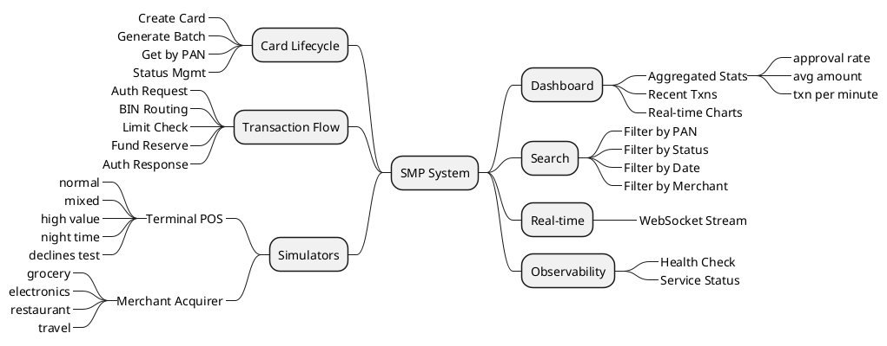

# Business Feature Structure

```plantuml
@startmindmap
* SMP System

left side

** Card Lifecycle
***_ Create Card
***_ Generate Batch
***_ Get by PAN
***_ Status Mgmt

** Transaction Flow
***_ Auth Request
***_ BIN Routing
***_ Limit Check
***_ Fund Reserve
***_ Auth Response

** Simulators
***_ Terminal POS
****_ normal
****_ mixed
****_ high value
****_ night time
****_ declines test
***_ Merchant Acquirer
****_ grocery
****_ electronics
****_ restaurant
****_ travel

right side

** Dashboard
***_ Aggregated Stats
****_ approval rate
****_ avg amount
****_ txn per minute
***_ Recent Txns
***_ Real-time Charts

** Search
***_ Filter by PAN
***_ Filter by Status
***_ Filter by Date
***_ Filter by Merchant

** Real-time
***_ WebSocket Stream

** Observability
***_ Health Check
***_ Service Status

@endmindmap
```

End-to-end fintech processing: card issuance → terminal/merchant simulation → auth routing → balance check → transaction logging → dashboard with real-time WebSocket.
