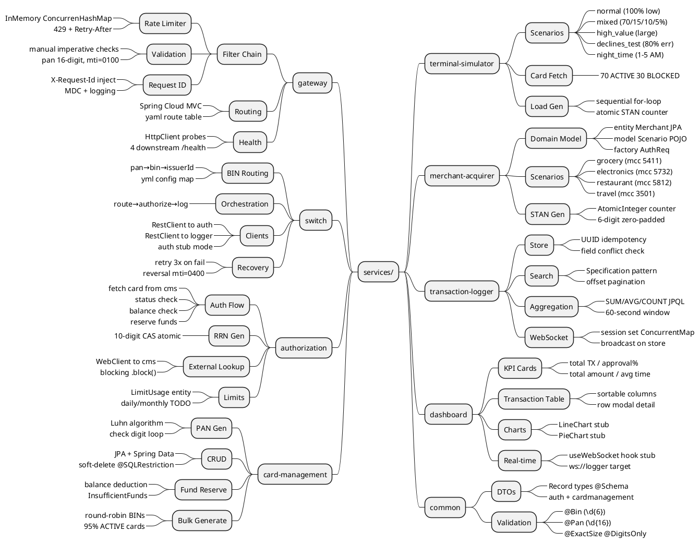

# High-Level Module Structure

```plantuml
@startmindmap
* services/

left side

** gateway
*** Filter Chain
**** Rate Limiter
*****_ InMemory ConcurrenHashMap
*****_ 429 + Retry-After
**** Validation
*****_ manual imperative checks
*****_ pan 16-digit, mti=0100
**** Request ID
*****_ X-Request-Id inject
*****_ MDC + logging
*** Routing
****_ Spring Cloud MVC
****_ yaml route table
*** Health
****_ HttpClient probes
****_ 4 downstream /health

** switch
*** BIN Routing
****_ pan→bin→issuerId
****_ yml config map
*** Orchestration
****_ route→authorize→log
*** Clients
****_ RestClient to auth
****_ RestClient to logger
****_ auth stub mode
*** Recovery
****_ retry 3x on fail
****_ reversal mti=0400

** authorization
*** Auth Flow
****_ fetch card from cms
****_ status check
****_ balance check
****_ reserve funds
*** RRN Gen
****_ 10-digit CAS atomic
*** External Lookup
****_ WebClient to cms
****_ blocking .block()
*** Limits
****_ LimitUsage entity
****_ daily/monthly TODO

** card-management
*** PAN Gen
****_ Luhn algorithm
****_ check digit loop
*** CRUD
****_ JPA + Spring Data
****_ soft-delete @SQLRestriction
*** Fund Reserve
****_ balance deduction
****_ InsufficientFunds
*** Bulk Generate
****_ round-robin BINs
****_ 95% ACTIVE cards

right side

** terminal-simulator
*** Scenarios
****_ normal (100% low)
****_ mixed (70/15/10/5%)
****_ high_value (large)
****_ declines_test (80% err)
****_ night_time (1-5 AM)
*** Card Fetch
****_ 70 ACTIVE 30 BLOCKED
*** Load Gen
****_ sequential for-loop
****_ atomic STAN counter

** merchant-acquirer
*** Domain Model
****_ entity Merchant JPA
****_ model Scenario POJO
****_ factory AuthReq
*** Scenarios
****_ grocery (mcc 5411)
****_ electronics (mcc 5732)
****_ restaurant (mcc 5812)
****_ travel (mcc 3501)
*** STAN Gen
****_ AtomicInteger counter
****_ 6-digit zero-padded

** transaction-logger
*** Store
****_ UUID idempotency
****_ field conflict check
*** Search
****_ Specification pattern
****_ offset pagination
*** Aggregation
****_ SUM/AVG/COUNT JPQL
****_ 60-second window
*** WebSocket
****_ session set ConcurrentMap
****_ broadcast on store

** dashboard
*** KPI Cards
****_ total TX / approval%
****_ total amount / avg time
*** Transaction Table
****_ sortable columns
****_ row modal detail
*** Charts
****_ LineChart stub
****_ PieChart stub
*** Real-time
****_ useWebSocket hook stub
****_ ws://logger target

** common
*** DTOs
****_ Record types @Schema
****_ auth + cardmanagement
*** Validation
****_ @Bin (\\d{6})
****_ @Pan (\\d{16})
****_ @ExactSize @DigitsOnly

@endmindmap
```

Service call topology: terminal/merchant → gateway → switch → (authorization → card-management) + transaction-logger. All sync HTTP REST, no queues.
