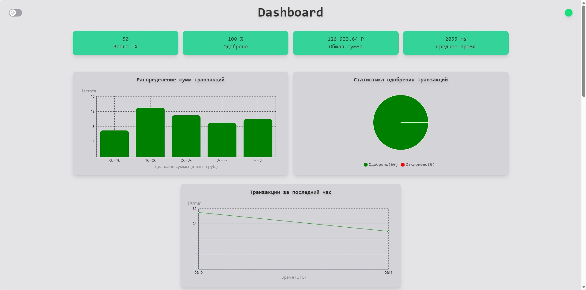
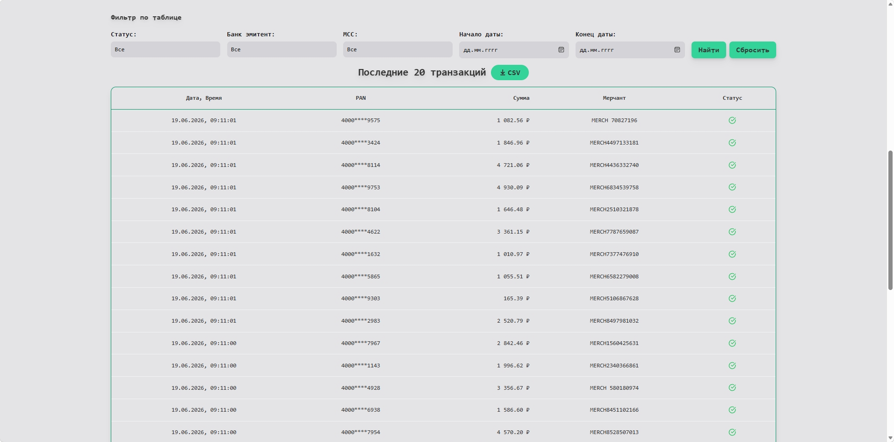
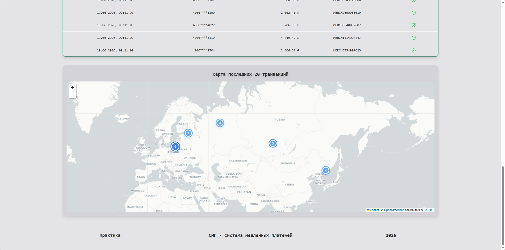
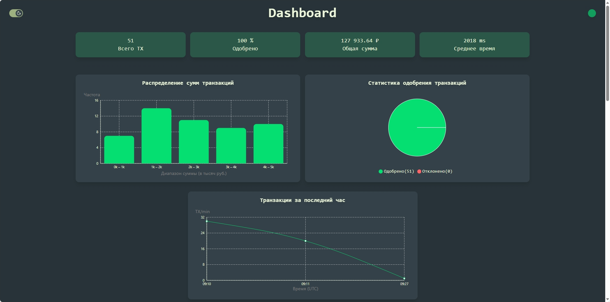
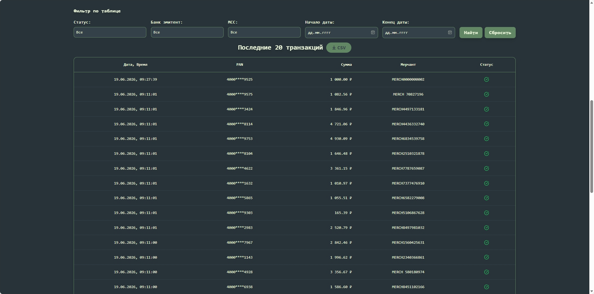
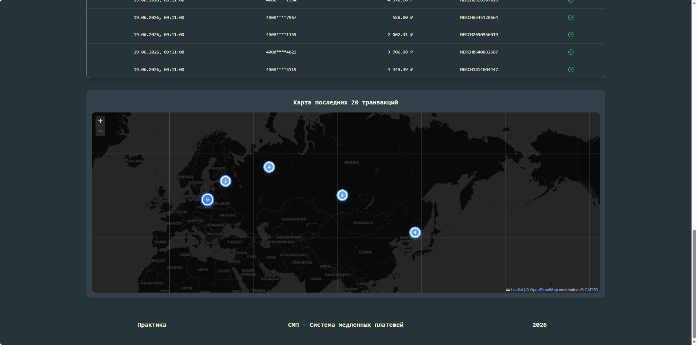

# Web-Dashboard

## Назначение

> Web Dashboard — это пользовательский интерфейс процессингового центра, который отображает ключевые метрики транзакций (KPI-карточки), графики динамики и таблицу последних операций в режиме реального времени.

---

## Скриншоты Dashboard

### Светлая тема








### Тёмная тема







> Переключение темы доступно через кнопку в шапке приложения

## Технологии

- **Язык:** TypeScript 5
- **Фреймворк:** React 18 + Vite
- **Стилизация:** Tailwind CSS
- **Визуализация данных:**
Recharts (линейный график, гистограмма, кругвая диаграмма),
Leaflet + React-Leaflet (работа с картой)
- **Форматирование дат:** date-fns + date-fns-tz
- **База данных:** нет
- **Контейнеризация:** Docker + Nginx
- **Тестирование:** Vitest + React Testing Library

---

## Endpoints

| Метод | Путь | Описание |
|-------|------|----------|
| GET | `/health` | Health-check |
| GET | `/` | Главная страница Dashboard (SPA) |

### Подробно

#### `GET /health`

**Ответ 200:**
```json
{
  "status": "UP",
  "service": "dashboard",
  "version": "1.0.0"
}
```

---

## Как запустить

> Dashboard доступен на сервере: http://5.53.124.5:3000/

Также есть другие способы запуска:

### Локально (без Docker)

```bash
npm install
npm run dev
```

### В Docker

```bash
docker build -t dashboard .
docker run -p 3000:3000 --env-file ../.env dashboard
```

### В составе Docker Compose

```bash
# Из корня репозитория
docker compose up -d dashboard
```

---

## Тестирование

```bash
# Unit-тесты
npm run test

# Линтер
npm run lint
```

---

## Взаимодействие с другими сервисами

| Сервис | Направление | Протокол | Зачем |
|--------|:----------:|----------|-------|
| Gateway | → исходящий | HTTP REST | Получение статистики (`/api/dashboard/stats`) и транзакций (`/api/dashboard/recent`, `/api/transactions/search`) |
| Transaction Logger | → исходящий | WebSocket | Получение потока транзакций в реальном времени (`/ws/transactions`) |

---

## Структура проекта

```text
dashboard/
├── src/
│   ├── api/                       # API-клиент
│   ├── components/                # React-компоненты
│   ├── contexts/                  # UI контекст для темной темы
│   ├── hooks/                     # Кастомные хуки
│   ├── types/                     # TypeScript-типы
│   ├── utils/                     # Вспомогательные функции
│   ├── mockData.ts                # Моковые данные для разработки
│   ├── App.tsx                    # Корневой компонент
│   ├── App.test.tsx               # Тесты корневого компонента
│   └── main.tsx                   # Точка входа
├── nginx.conf                     # Конфигурация Nginx (раздача статики + /health)
├── Dockerfile                     # Multi-stage build (Node → Nginx)
├── vite.config.ts                 # Конфигурация Vite
├── package.json
└── README.md
```

---

## Архитектура компонентов

### Презентационные (UI-элементы)
Компоненты, отвечающие за визуализацию данных:
- **`KpiCards.tsx`** — отображение ключевых метрик (карточки KPI);
- **`TransactionLineChart.tsx`** — линейный график динамики транзакций во времени за последний час;
- **`TransactionHistogram.tsx`** — гистограмма распределения сумм транзакций;
- **`TransactionPieChart.tsx`** — круговая диаграмма статусов (Approved/Declined);
- **`TransactionsMap.tsx`** — географическая карта с маркерами транзакций;
- **`TransactionTable.tsx`** — таблица со списком последних 20 операций;
- **`Header.tsx`** — шапка приложения с KPI-карточками, переключателем темы и индикатором соединения.

### Функциональные (Бизнес-логика)
Компоненты, управляющие состоянием, фильтрацией и взаимодействием с пользователем:
- **`Filters.tsx`** — панель фильтров. Управляет параметрами запроса (статус, банк эмитент, категория и даты (с-до)), вызывает функцию searchTransactions и передает отфильтрованные данные в родительский контейнер;
- **`TransactionModal.tsx`** — модальное окно с детальной информацией о транзакции. Отвечает за логику открытия/закрытия и отображение расширенных данных.

### Кастомные хуки
Инкапсулируют всю логику получения данных, управления WebSocket-соединением и агрегации статистики. Компоненты используют их и получают готовые состояния:

-   **`useWebSocket.ts`** — хук для управления WebSocket-соединением. Отвечает за подключение, переподключение при разрыве связи и обработку входящих сообщений;
-   **`useLiveStats.ts`** — хук для получения KPI-метрик в реальном времени. Подписывается на поток данных через WebSocket и обновляет карточки статистики без перезагрузки страницы;
-   **`useTransactions.ts`** — хук для работы с таблицей транзакций. Обрабатывает фильтры и загружает детали операции для модального окна;
-   **`useStats.ts`** — хук для изначальной загрузки KPI-метрик при открытии страницы;
-   **`useLocations.ts`** — хук для подготовки гео-данных и форматирования их для отображения маркеров на карте (`TransactionsMap`).

---

## Авторы

- Алина Рамазанова — разработчик
- Юля Кулакова — разработчик

**Группа:** B (Gateway & Frontend)
