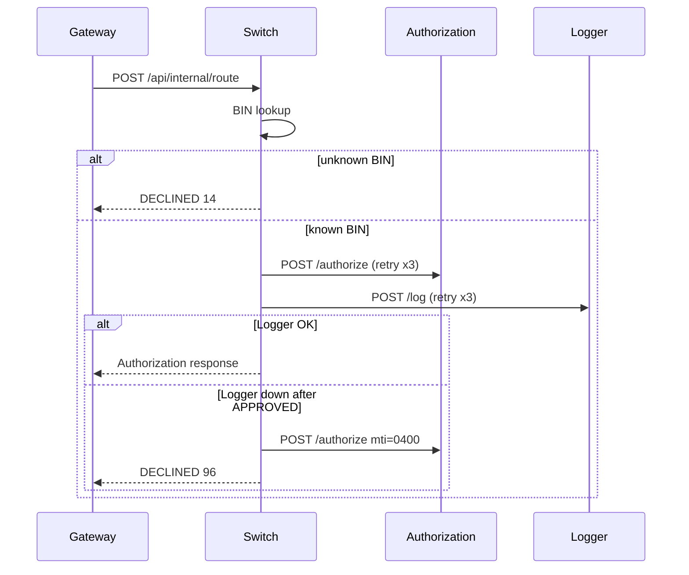

# Switch

## Назначение

Switch — центральный маршрутизатор СМП. Определяет банк-эмитент по BIN карты, направляет запрос в Authorization Service и синхронно записывает транзакцию в Transaction Logger.

---

## Технологии

- **Язык:** Java 21
- **Фреймворк:** Spring Boot 3
- **База данных:** нет (только HTTP REST)
- **Контейнеризация:** Docker

---

## Endpoints

| Метод | Путь | Описание |
|-------|------|----------|
| GET | `/health` | Health-check Switch и доступности Authorization |
| POST | `/api/internal/route` | Маршрутизация транзакции: BIN → Authorization → Logger |

Swagger UI: `http://localhost:8082/swagger-ui.html`

### Подробно

#### `GET /health`

**Ответ 200:**
```json
{
  "status": "ok",
  "service": "switch",
  "version": "1.0.0",
  "dependencies": {
    "authorization": "ok"
  }
}
```

#### `POST /api/internal/route`

**Тело запроса:** `AuthorizationRequest` (от Gateway)

**Ответ 200:** `AuthorizationResponse`

**Ошибки на уровне бизнес-логики (в теле ответа):**

| responseCode | Условие |
|--------------|---------|
| `14` | Неизвестный BIN |
| `05` | Authorization недоступен после 3 попыток |
| `96` | Logger недоступен после APPROVED — выполнен reversal |
| `51`, `54`, … | Decline от Authorization (pass-through) |

---

## Таблица BIN → issuerId

| BIN | issuerId | Банк |
|-----|----------|------|
| 400000 | ISS001 | Банк 1 |
| 400001 | ISS002 | Банк 2 |
| 400002 | ISS003 | Банк 3 |
| 400003 | ISS004 | Банк 4 |
| 400004 | ISS005 | Банк 5 |

---

## Схема маршрутизации



---

## Конфигурация

| Переменная | Значение по умолчанию | Описание |
|------------|----------------------|----------|
| `PORT` | `8082` | Порт сервиса |
| `AUTH_URL` | `http://localhost:8083` | URL Authorization Service |
| `LOGGER_URL` | `http://localhost:8088` | URL Transaction Logger |
| `switch.retry.max-attempts` | `3` | Число retry для Auth и Logger |
| `switch.retry.logger-read-timeout-ms` | `2000` | Read timeout Logger (мс) |

---

## Как запустить

### Локально (без Docker)

```bash
cd services/switch
mvn spring-boot:run
```

Требуются запущенные Authorization и Transaction Logger (или соответствующие URL в переменных окружения).

### В Docker

```bash
docker build -f services/switch/Dockerfile -t smp-switch .
docker run -p 8082:8080 -e AUTH_URL=http://host.docker.internal:8083 -e LOGGER_URL=http://host.docker.internal:8088 smp-switch
```

### В составе Docker Compose

```bash
docker compose up -d switch authorization transaction-logger
```

---

## Тестирование

```bash
cd services/switch
mvn test
```

### Пример curl

```bash
curl -X POST http://localhost:8082/api/internal/route \
  -H "Content-Type: application/json" \
  -d '{
    "mti": "0100",
    "stan": "000001",
    "pan": "4000001234560001",
    "processingCode": "000000",
    "amount": 150000,
    "currencyCode": "643",
    "transmissionDateTime": "2026-06-01T10:30:00",
    "terminalId": "TERM001",
    "merchantId": "MERCH12345678901",
    "mcc": "5411",
    "acquirerId": "ACQ001"
  }'
```

---

## Integration testing

Полный сквозной прогон (дни 11–13):

1. Поднять стек:
   ```bash
   docker compose up -d gateway switch authorization transaction-logger card-management
   ```

2. **Успешная транзакция:** `POST /api/internal/route` с PAN `400000…` → `APPROVED`, `responseCode=00`. Проверить запись в Logger через Gateway `GET /api/transactions/search`.

3. **Неизвестный BIN:** PAN `9999991234560001` → `DECLINED`, `responseCode=14`. Authorization и Logger не вызываются.

4. **Logger недоступен:** `docker stop smp-transaction-logger`, отправить APPROVED-транзакцию → `DECLINED`, `responseCode=96`. Switch отправляет reversal (`mti=0400`) в Authorization.

5. **Через Gateway:** `POST http://localhost:{GATEWAY_PORT}/api/transactions` с тем же телом.

6. **Decline pass-through:** карты BLOCKED / INSUFFICIENT из CMS → decline-коды от Authorization проходят через Switch и записываются в Logger.

---

## Взаимодействие с другими сервисами

| Сервис | Направление | Протокол | Зачем |
|--------|:----------:|----------|-------|
| Gateway | ← входящий | HTTP REST | Присылает транзакции на маршрутизацию |
| Authorization | → исходящий | HTTP REST | Авторизация и reversal (`mti=0400`) |
| Transaction Logger | → исходящий | HTTP REST | Синхронная запись транзакций |

---

## Структура проекта

```text
switch/
├── src/main/java/com/processing/
│   ├── controller/     # RouteController, HealthController
│   ├── service/        # RouteService, RoutingService, clients
│   ├── model/          # DTO records
│   ├── config/         # SwitchProperties, RestClientConfig
│   └── enums/
├── src/test/java/
├── Dockerfile
└── README.md
```
